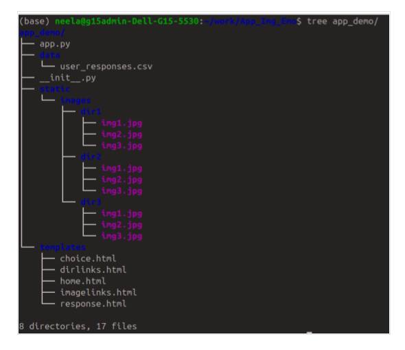

# Web Application to Annotate and Validate Emotions

This is a simple and easy-to-follow web application developed with Python and Flask to annotate facial expressions.

This work is a custom application developed for the ROSANA project, Centro de Tecnologia da Informação (CTI) Renato Archer, Brazil. 

## Directory structure:
- Programming logic is in app.py. Keep it in app_demo package.
- Keep your images in static/images/ directory. 
- Keep html code in templates directory
- User responses are recorded as a csv file in data directory.
 

 

## How to use:
Download the folder app_demo. From app_demo directory path run on the terminal:
> 'python app.py'

The terminal will show the address where the app is running. Paste it on the browser to access the application.

The workflow of the application is as per shown in the figure:

Woking of the application:

How to cite:
> Neelakshi Joshi, Web Application to Annotate and Validate Emotions, Seminário em Tecnologia da Informação do Programa de Capacitação Institucional (PCI) do CTI Renato Archer, XIV Seminário PCI - 2024, ISSN 2764-636X.
https://www.gov.br/cti/pt-br/publicacoes/producao-cientifica/seminario-pci/xiv_seminario_pci-2024.
